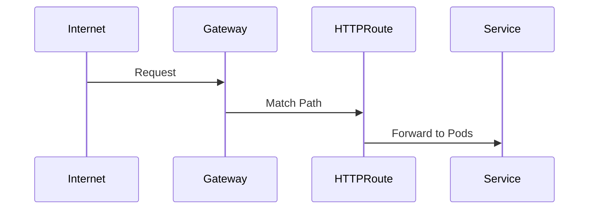

# Architecture: Gateway API
> Maturity: Lab / Reference Implementation

## System Diagram
The following Mermaid.js sequence diagram maps the core workflow and interactions:

## Role-Oriented Model
The standard Kubernetes Ingress is a single object. If a developer wants to add a new route, they must edit the Ingress object, which also contains the TLS certificate configuration and the Load Balancer definition. This is a massive security and stability risk.

The Gateway API introduces three personas:
1. **Infrastructure Provider** (Cloud Provider) → Defines the `GatewayClass`
2. **Cluster Operator** (Platform Team) → Deploys the `Gateway`
3. **Application Developer** (Dev Team) → Deploys the `HTTPRoute`

## Security Boundaries via `allowedRoutes`
In this architecture, the `Gateway` resides in the highly-secured `platform-system` namespace. It terminates TLS using a wildcard certificate that developers cannot access. 

The Gateway explicitly trusts routes coming from namespaces labeled `shared-gateway-access: "true"`. The Developer deploys an `HTTPRoute` in their own `payment-system` namespace. The Gateway API controller automatically binds the Developer's route to the Platform's gateway.

This achieves complete decoupling of infrastructure provisioning from application routing.
